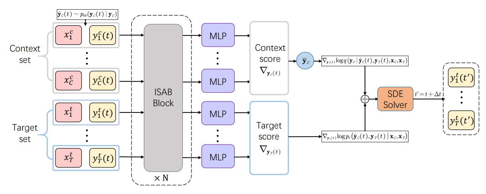

# Score-based Neural Processes ([IEEE TNNLS](https://ieeexplore.ieee.org/abstract/document/10847300))

This repository is the official implementation of Score-based Neural Processes (SNPs). 

<p align="center">

<br>
<em> Score-based Neural Process (SNP) is a new member of the <a href="https://yanndubs.github.io/Neural-Process-Family/text/Intro.html">neural process family</a>, drawing inspiration from recently developed <a href="https://arxiv.org/pdf/2011.13456">score-based generative models</a>. </em>
</p>

## Requirements

To install requirements:

```setup
pip install -r requirements.txt
```

## Training

To train the model(s) in the paper, run this command:

```train
python train_snp.py --dataset celeba32

python train_ERA5.py 

python train_CFD.py 
```


## Evaluation

To evaluate my model, run:

```eval
python test_snp.py --dataset celeba32

python test_ERA5.py 

python test_CFD.py 
```

## Reference

```bibtex
@article{dou2025score,
  title={Score-Based Neural Processes},
  author={Dou, Hongkun and Lu, Junzhe and Li, Zeyu and Zhong, Xiaoqing and Yao, Wen and Yang, Lijun and Deng, Yue},
  journal={IEEE Transactions on Neural Networks and Learning Systems},
  year={2025},
  publisher={IEEE}
}
```
